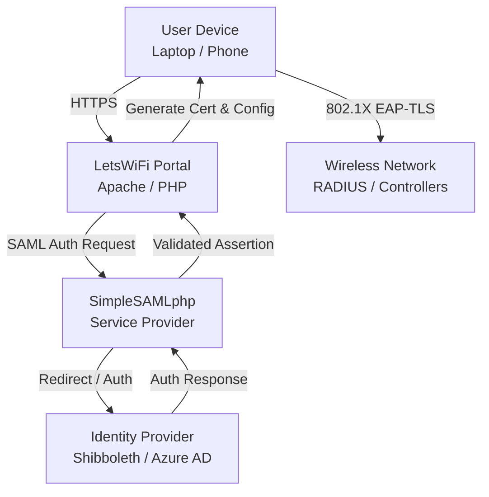

# LetsWiFi Portal – Adoption Guide for Higher Education Institutions

> [!CAUTION]
> I have not had a chance to verify these steps on a clean install. Please open pull requests if you find something I should update/fix.
> Thanks!

>[!NOTE]
> This particular document was generated with AI assistance

## 1. Purpose

This guide describes how to adopt and operate a locally hosted wireless onboarding solution using the LetsWiFi portal integrated with institutional identity systems.

This approach enables institutions to:

- Support **secure wireless onboarding (EAP-TLS)**
- Integrate with existing **SAML-based identity providers**
- Reduce reliance on commercial onboarding/licensing solutions
- Maintain local control over authentication and certificate issuance

---

## 2. Problem This Solves

Many institutions face challenges with:

- Complex user onboarding for secure wireless (eduroam/EAP-TLS)
- High licensing costs for proprietary onboarding systems
- Fragmented identity and certificate workflows
- Limited flexibility in managing onboarding experience

This solution provides:

- A **standards-based, identity-driven onboarding model**
- Centralized control using existing IAM infrastructure
- A **cost-effective alternative** to commercial platforms

---

## 3. High-Level Architecture

### System Overview

### Core Components

| Component | Purpose |
| ---------- | -------- |
| LetsWiFi Portal | User onboarding interface and configuration distribution |
| Apache / PHP | Web platform hosting the portal |
| SimpleSAMLphp | Integration with institutional identity |
| Identity Provider (IdP) | Authentication source (e.g., Shibboleth, Azure AD) |
| Certificate Authority (CA) | Issues EAP-TLS certificates |
| Database (SQLite/MySQL) | Stores configuration and state |
| Wireless Infrastructure | Enforces EAP-TLS authentication |

---

## 4. Prerequisites

### Technical Capabilities

- Linux-based server hosting
- Apache / PHP support
- Database capability (SQLite, MySQL, or MariaDB)
- PKI / certificate management capability

### Organizational Dependencies

- Access to Identity and Access Management (IAM) team  
- Ability to integrate with SAML IdP  
- Coordination between:
  - Network team  
  - Server/hosting team  
  - IAM/security team  

---

## 5. Adoption Model

### Phase 1 – Evaluation

- Validate compatibility with:
  - IAM system (SAML)
  - Wireless authentication (EAP-TLS)
- Identify stakeholders and ownership
- Compare against existing onboarding solutions

---

### Phase 2 – Pilot Deployment

- Deploy portal in a non-production or limited scope environment
- Integrate with IAM (SAML metadata exchange)
- Configure a test realm
- Validate:
  - Authentication flow
  - Certificate issuance
  - Device onboarding experience

---

### Phase 3 – Initial Production Rollout

- Deploy production instance
- Begin onboarding select user groups
- Monitor:
  - Success/failure rates
  - User experience issues
  - Certificate handling behavior

---

### Phase 4 – Full Adoption

- Expand to full campus or organizational use
- Transition from legacy onboarding methods
- Normalize support processes

---

## 6. Operational Model

### Ownership Model

| Area | Recommended Owner |
| ------ | ------------------ |
| Linux / Web Server | Server / Infrastructure team |
| Portal Application | Network / Engineering |
| Identity Integration (SAML) | IAM team |
| Certificates / PKI | Security / PKI team |
| Wireless Authentication | Network team |

---

### Day-to-Day Operations

- Monitor service availability (portal + authentication)
- Support user onboarding issues
- Maintain configuration (realms, clients, contact info)

---

### Maintenance Activities

- OS patching (server team)
- Certificate lifecycle management (PKI/IAM)
- SAML metadata updates (IAM)
- Database backup and integrity checks

---

### Common Failure Scenarios

| Issue | Likely Area | Action |
| ------ | ------------ | ------- |
| SAML login fails | IAM / SAML config | Verify metadata, IdP configuration |
| Portal unavailable | Server | Check Apache, system health |
| Certificates not issued | PKI / config | Verify CA configuration and trust chain |
| Device fails to connect | Network / wireless | Validate EAP-TLS and policy |

---

### Escalation Boundaries

- Operations handles:
  - Standard onboarding issues  
  - Service availability  
  - Known failure scenarios  

- Architecture/design is engaged only for:
  - New onboarding patterns  
  - Changes to identity model  
  - Cross-system integration issues  

---

## 7. Security Considerations

- Protect private keys and certificate material
- Ensure secure configuration of Apache and PHP
- Enforce HTTPS-only access
- Regularly update:
  - Dependencies
  - SSL/TLS configurations  
- Coordinate with IAM for SAML security best practices

---

## 8. Benefits & Impact

### Operational Benefits

- Reduced reliance on proprietary onboarding tools  
- Improved consistency in onboarding process  
- Greater flexibility in customization  

### Security Benefits

- Strong authentication using EAP-TLS  
- Integration with institutional identity policies  

### Cost Benefits

- Potential reduction in annual licensing costs  
- Leverages existing infrastructure investments  

---

## 9. Key Adoption Lessons

- **Identity integration is the critical path — engage IAM early**
- **Segmentation and policy alignment must be defined before onboarding**
- **Operational ownership must be clear to avoid long-term dependency**
- **Start small (pilot), then scale — avoid big-bang rollouts**
- Expect initial friction — refine through iteration

---

## 10. Deployment Guide

For step-by-step installation and configuration, refer to:

> **DEPLOY.md**

---

## Summary

This approach enables institutions to deliver a **secure, scalable, and cost-effective wireless onboarding experience** using existing identity infrastructure and open technologies. A phased adoption model ensures low risk while enabling long-term operational independence.
